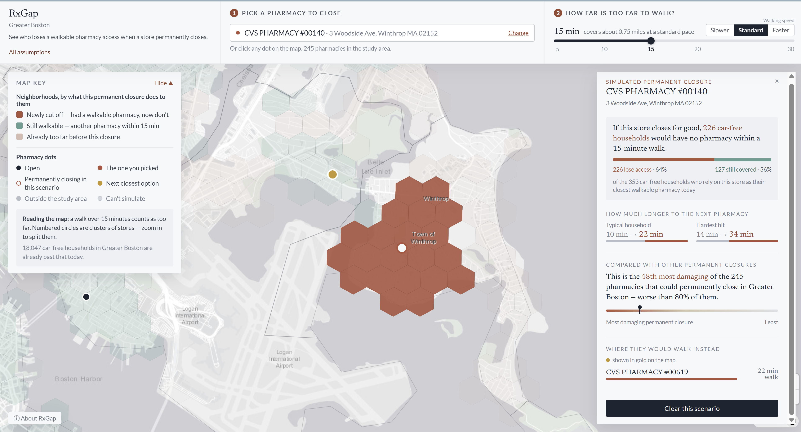

# RxGap


A pharmacy permanent-closure impact explorer for Greater Boston.

**Live demo:** [https://rxgap.vercel.app/](https://rxgap.vercel.app/)



Pick a licensed walk-in pharmacy, set a **max walk**, simulate it permanently closing, and see which no-vehicle households lose that walk — and how much farther the next licensed store is.

## Why RxGap

Boston has seen 41 pharmacy closures since 2018. In December 2025, the Boston City Council unanimously backed a petition asking Massachusetts to extend the required notice for permanent pharmacy closures from 14 days to 120 days, so communities and local officials would have time to respond. RxGap explores what that planning window could look like: select a licensed walk-in pharmacy, simulate its permanent closure, and see which no-vehicle households lose a reasonable walk.

The pressure is wider than one city. The Massachusetts Health Policy Commission counted nearly 370 pharmacy closures statewide since 2018, and found that 2024–2025 closures shifted into urban areas with low vehicle ownership. This 22-municipality study area has about **171,000** no-vehicle households (ACS 2023). At the default 15-minute max walk, about **18,000** of them are already beyond a licensed storefront — before anyone simulates a permanent closure.

Sources: [Boston City Council petition coverage (MassLive)](https://www.masslive.com/boston/2025/12/boston-seeks-longer-notification-period-for-pharmacy-closures-to-stop-gaps-in-care.html); [GBH](https://www.wgbh.org/news/politics/2025-12-12/boston-asks-state-officials-for-more-notice-when-pharmacies-close); [HPC DataPoints 31](https://masshpc.gov/publications/datapoints-series/issue-31-when-closest-pharmacy-too-far-mapping-pharmacy-deserts). The 41-closure figure is Councilor Gabriela Coletta Zapata’s, as reported at the December 2025 hearing. The petition asks the state to change the notice rule; it is not itself the law.

## Who it's for

Anyone who can click a pharmacy on a map. Neighbors and residents who heard their CVS is permanently closing and want to know whether the next walk is still reasonable. Journalists and advocates who need a clearer picture than a list of remaining pins. Planning staff and local officials who may now get months of notice and need to see *who* loses access, not only *that* a store is permanently closing.

It is not a “pharmacy near me” app, and it does not require a GIS background.

## What Overture is doing here

The product is built on [Overture Maps](https://overturemaps.org/) (release pinned in `pipeline/config.py`), extracted for the analysis envelope with DuckDB in `pipeline/extract_overture.py`.

| Theme | Role |
| --- | --- |
| **Transportation** (segments + connectors) | Pedestrian graph. Walk distance is origin snap + path + destination snap, joined on `connector_id`. |
| **Buildings** | ACS no-vehicle households are allocated onto buildings, then aggregated to [H3](https://h3geo.org/) resolution 9. |
| **Places** | Storefront pin matching and geocode fallback when the Census batch geocoder misses. |

Pharmacies themselves are not an Overture layer. Operating status comes from the MA Board retail roster. Overture **addresses** and **divisions** are extracted but unused: municipal boundaries come from Census TIGER, which matches the 22-municipality study definition more cleanly.

## Study area

For this analysis, RxGap defines Greater Boston as **22 complete municipalities**: Boston, Cambridge, Somerville, Brookline, Newton, Watertown, Belmont, Arlington, Medford, Malden, Everett, Chelsea, Revere, Winthrop, Lynn, Quincy, Milton, Braintree, Dedham, Needham, Waltham, and Weymouth.

Demand and closable pharmacies exist only inside that municipal union. A **3 km routing envelope** beyond those boundaries (buffered in EPSG:26986) supplies network continuity and context pharmacies so routes are not cut at the study edge. Pins in the envelope but outside the study union are not ranked as closures.

## How it works

The map shades H3 demand cells by whether a licensed storefront is within the max walk (default 15 minutes at a documented walking-speed assumption). Select a pharmacy and click **Simulate permanent closure**. Newly lost cells turn coral. Changing max walk or the speed assumption recolors the map; demand-cell geometry does not change.

Headline impact is household-weighted: how many no-vehicle households lose a walk under the threshold, and the typical extra walk for households whose modeled nearest pharmacy is that location.

**Pharmacies.** MA Board currently licensed *Retail Pharmacy* roster; NPPES taxonomy `3336C0003X` is type evidence, not operating status. Only walk-in storefronts that snap to the network and lie in the study union can be closed in the tool.

**Demand.** ACS 2023 5-year B25044 (no-vehicle households) allocated onto Overture buildings inside each block group, then aggregated to H3 resolution 9. No demand is allocated in the 3 km buffer.

**Walking.** Overture transportation segments joined on `connector_id`. The UI’s primary control is **max walk** in minutes; network meters convert with a documented walking-speed assumption (default 3.0 mph / Standard). Slower (2 mph) and Faster (4 mph) are available under Assumptions for sensitivity. Sample walks are checked against geodesic length and an external foot-routing reference in `data/reports/validation.json` — those checks are diagnostics, not the production distance model.

| Assumption | Speed | Source |
| --- | --- | --- |
| Slower | 2.0 mph | MUTCD slower-walker design speed |
| Standard | 3.0 mph *(default)* | Common FHWA pedestrian planning speed |
| Faster | 4.0 mph | Brisk adult walk |

## Data sources

| Layer | Source |
| --- | --- |
| Currently licensed location | MA Board of Registration in Pharmacy, retail roster |
| Pharmacy type | NPPES taxonomy `3336C0003X` |
| Storefront pin fallback | Census batch geocoder, then NPPES, Overture places, OSM Nominatim |
| Buildings, places, walk network | [Overture Maps](https://overturemaps.org/) (release pinned in `pipeline/config.py`) |
| Households without a vehicle | ACS 2023 5-year B25044 |
| Municipal boundaries | Census TIGER/Line county subdivisions |

Build counts and checks are written to `data/reports/` (including `geography.json`).

## Trade-offs and cuts

The model is walk-only, license-only, and nearest-store only. That keeps the question honest: who loses a *walk* to a *currently licensed walk-in* if this storefront permanently closes.

**Cut:** transit, driving, delivery/mail-order, insurance networks, medication availability, hours, and opening-location optimization.

**Other trade-offs:**

- Nearest and second-nearest licensed walk-in stores are modeled; observed shopping trips are not.
- Board retail licenses are the operating-status filter. An active NPI is not treated as proof the storefront is open.
- Duplicate licenses for one storefront remain visible; only one identity is used for routing.
- ACS margins of error are kept at block-group and citywide level. They are not spread onto H3 cells.
- Households near the study edge may have a nearer pharmacy in the routing envelope that is not closable in the tool.

The pipeline refuses to finish if a known-closed storefront is marked active, if demand allocation drops households, or if the pedestrian graph fails continuity checks (including Boston–Cambridge crossings of the Charles).

## Run locally

```bash
python -m venv .venv
# Windows: .venv\Scripts\activate
pip install -r requirements.txt

cd web
npm install
npm test
npm run lint
npm run build
npm run dev
```

The UI reads `web/public/data/rxgap.json`.

### Rebuild the data

```bash
python -m pipeline.build --skip-cms
python -m unittest discover -s tests
```

That resolves study geography, extracts Overture for the analysis envelope bbox, geocodes licensed pharmacies (retained inside the envelope polygon), builds the walk graph, allocates demand inside the study union, computes nearest/second stores, and writes `web/public/data/rxgap.json`.

## Deploy

[Vercel](https://vercel.com) hosts the frontend at [https://rxgap.vercel.app/](https://rxgap.vercel.app/). Root `vercel.json` builds `web/` and publishes `web/dist`.

## License and citation

Copyright © 2026 Vedika Srivastava.

RxGap is licensed under [Creative Commons Attribution 4.0 International (CC BY 4.0)](https://creativecommons.org/licenses/by/4.0/). You may use, share, and adapt this work — including commercially — as long as you give appropriate credit, link to the license, and note if you changed anything.

**Suggested citation:**

> Srivastava, Vedika. (2026). *RxGap* [Computer software]. https://github.com/VedikaSrivastava/rxgap

Third-party data (ACS, Overture, MA Board roster, etc.) and dependencies keep their own licenses and terms.
